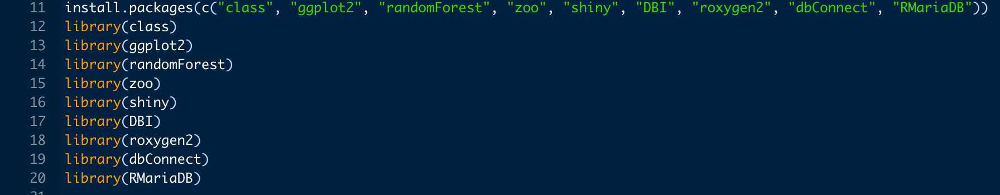
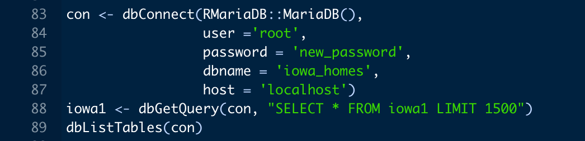

# Iowa Homes Prediction Model
Using R and SQL to create a machine learning algorithm that reads from a database

## Installation 
Start by installing the IDE's

[Rstudio](https://www.rstudio.com/products/rstudio/download/)
[MySQL Workbench](https://dev.mysql.com/downloads/workbench/)

Download R & MySQl
1. [R](https://cran.r-project.org/bin/windows/base/)
2. [MySQL](https://www.mysql.com/downloads/)

### Data Cleaning
1. Start by importing the data into R through a read csv function
2. Remove all variables which are not of entire use
3. Write away clean data set with write csv function and new table name

### Convert csv into SQL
1. Create a new database
2. Import table into SQl database

### Install packages into R

### Read dataset from SQL by connecting to it

After this run the alogorithm with the UI

### Make a GCP account
1. Create a new account
2. Create a VM instance
3. Change Port to 80 in config settings from SSH
4. Install all relative packages above
5. Clone github repository 
6. Dump SQL databse into files

### Trello Board for Project

### Link to Application 
### [My Application](http://35.246.119.178/PredictionModel/)
1. Fill out all requested inputs for the model
2. Click Predict and value will update
